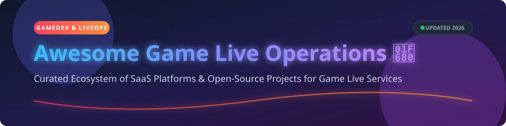

# Awesome Game Live Operations 🎮🚀



<p align="center">
  <a href="https://github.com/ishandutta2007/Awesome-Awesome-Awesome"></a>
  <a href="https://discord.gg/jc4xtF58Ve"></a>
  <a href="https://github.com/ishandutta2007/Awesome-Game-Live-Operations"></a>
  <a href="https://github.com/ishandutta2007/Awesome-Game-Live-Operations/fork"></a>
  <a href="https://github.com/ishandutta2007"></a>
</p>

> 🕹️ **A curated ecosystem of SaaS platforms & open-source infrastructure for Game Live Operations (LiveOps), Live Service Management, Remote Configuration, Player Engagement, and Real-Time Multiplayer Operations.**

---

## 📖 Overview & SEO Summary

Welcome to **Awesome Game Live Operations (LiveOps)**! This directory tracks industry-leading **SaaS platforms** and **open-source game backends** engineered for modern connected games. 

Whether you are building cross-platform multiplayer games in **Unity**, **Unreal Engine**, **Godot**, or custom C++/Rust/Go engines, these tools empower game studios to:
- ⚙️ **Deploy Remote Configuration & Feature Flags** without publishing client updates or app store approvals.
- 🏆 **Manage Player Progression & Virtual Economies** including cloud saves, inventories, leaderboards, and achievements.
- 💬 **Enable Real-Time Voice & Text Chat** with positional audio, channel rosters, and noise suppression.
- 📣 **Drive Player Retention & Engagement** via targeted push notifications, omni-channel messaging, and automated event calendars.
- ⚔️ **Scale Server Infrastructure & Matchmaking** for low-latency session-based or persistent online games.

---

## 📊 Market Overview & Industry Structure

> 💡 **Market Size & Structure:** The global **Game LiveOps and Backend Infrastructure market** is estimated at **$4.5B–$6.0B+ (2026)** and growing rapidly driven by the dominance of free-to-play (F2P) and live-service gaming models across mobile, PC, and consoles. The market is **moderately fragmented** — while massive cloud providers (Microsoft Azure PlayFab, Unity Gaming Services) hold dominant enterprise market share, specialized vendors (Beamable, AccelByte, Heroic Labs) and open-source stacks (LiveKit, Flagsmith, Novu) capture significant developer adoption through modular and self-hosted offerings.

---

## 📑 Table of Contents

- [☁️ SaaS / Hosted LiveOps Platforms](#️-saas--hosted-liveops-platforms)
- [⚡ Open-Source GitHub Projects](#-open-source-github-projects)
- [🛠️ Architecture & Stack Recommendations](#️-architecture--stack-recommendations)
- [🤝 How to Contribute](#-how-to-contribute)
- [💖 Support & Community](#-support--community)
- [📈 Star History](#-star-history)
- [⚠️ Disclaimer](#️-disclaimer)

---

## ☁️ SaaS / Hosted LiveOps Platforms

The table below lists top SaaS and managed cloud platforms for game backend and LiveOps infrastructure, sorted by **company scale (valuation / market capitalization)** descending.

| Product | Description | Valuation / Revenue Scale | Starting Paid Tier Pricing | Free Tier / Trial Limits |
| :--- | :--- | :--- | :--- | :--- |
| **[Microsoft PlayFab](https://playfab.com)** 🎮 | Complete backend platform providing player accounts, CloudScript server logic, segmentation, A/B testing, virtual economy, and task scheduling. | **$3.66 Trillion** (Microsoft Market Cap) | Pay-As-You-Go starting at $0.003 / 1k meter units (~$99/mo typical Indie plan base) | Free Developer Plan (Up to 100,000 total accounts, unlimited test titles) |
| **[Unity Vivox](https://unity.com/products/vivox)** 🎤 | Managed 2D/3D positional voice chat and text messaging service for cross-platform multiplayer games. | **$18.22 Billion** (Unity Market Cap) | $0.0050 per Peak Concurrent User (PCU) per month above free tier | Free up to 5,000 Peak Concurrent Users (PCU) forever |
| **[Unity Remote Config](https://unity.com/products/remote-config)** 🎛️ | Cloud service for game tuning, feature flagging, A/B testing, and real-time player segmentation without client patches. | **$18.22 Billion** (Unity Market Cap) | Included in Unity Gaming Services (UGS) Pay-As-You-Go ($0.001 per 1k requests) | Free up to 10,000 Monthly Active Users (MAU) |
| **[Leanplum (CleverTap)](https://www.clevertap.com)** 📱 | Mobile engagement and marketing automation platform offering segmentation, push notifications, and A/B testing for live games. | **~$1.0 Billion** (CleverTap Valuation) | Growth Plan starting at $999 / month | 30-Day Free Trial (Full platform access up to 10,000 MAU) |
| **[Airship](https://www.airship.com)** 🔔 | Enterprise customer engagement and messaging platform for automated player retention campaigns and in-app messaging. | **~$500 Million** (Valuation / ~$100M+ ARR) | Essentials Plan starting at $99 / month | 30-Day Free Trial (Includes 10,000 push notifications/mo) |
| **[AccelByte](https://accelbyte.io)** 🛡️ | Fully managed, modular backend platform providing identity, store/catalog, matchmaking, session management, and achievements. | **~$150 Million** (Valuation / Series B) | Managed Cloud starting at $500 / month base platform fee | 14-Day Free Trial (Full sandbox access for up to 500 test accounts) |
| **[OneSignal](https://onesignal.com)** 📩 | Omnichannel customer engagement platform widely used by game studios for push notifications, SMS, in-app messaging, and email. | **~$100 Million** (Valuation / $84M Funding) | Growth Plan starting at $9 / month + usage | Free Plan forever (Up to 10,000 web/mobile push subscribers) |
| **[Beamable](https://www.beamable.com)** ⚡ | Open-core LiveOps platform for Unity and Unreal providing C# microservices, live events, virtual economy, and content management. | **~$30 Million** (Estimated Valuation / Series A) | Professional Tier starting at $250 / month | Free Developer Plan (Up to 1,000 Monthly Active Users / MAU) |
| **[Pragma Platform](https://pragma.gg)** 🔑 | Cross-platform identity, matchmaking, and player account backend built by AAA veterans with rate-limited logins and GDPR compliance. | **~$25 Million** (Estimated Valuation / $22M Funding) | Custom Studio Enterprise Tier starting at $1,500 / month | 30-Day Private Developer Sandbox Access |
| **[LootLocker](https://lootlocker.com)** 🧰 | Turnkey game backend platform with open-source SDKs for Unity and Unreal, guest/platform auth, inventories, and cross-platform saves. | **~$10 Million** (Indie Seed Backed) | Pro Plan starting at $49 / month | Free Plan forever (Up to 10,000 Monthly Active Users / MAU) |

---

## ⚡ Open-Source GitHub Projects

Below is a comprehensive collection of self-hostable open-source game backends, LiveOps services, WebRTC voice infrastructure, and feature-flagging servers. 

Repositories are sorted by **GitHub Star Count** descending.

| Project / Repository | Category | Star Count ⭐️ | Description | License |
| :--- | :--- | :--- | :--- | :--- |
| **[novuhq/novu](https://github.com/novuhq/novu/stargazers)** 🔔 | Engagement & Messaging | [](https://github.com/novuhq/novu/stargazers) | Open-source notification infrastructure for in-app, email, push, and SMS messaging. | MIT |
| **[livekit/livekit](https://github.com/livekit/livekit/stargazers)** 🎙️ | Real-Time Voice & Video | [](https://github.com/livekit/livekit/stargazers) | Ultra low-latency WebRTC developer platform for real-time voice, video, and data streaming. | Apache-2.0 |
| **[heroiclabs/nakama](https://github.com/heroiclabs/nakama/stargazers)** ⚔️ | Game Backend | [](https://github.com/heroiclabs/nakama/stargazers) | Distributed server for social, real-time games, and apps. Features accounts, chat, multiplayer, and leaderboards. | Apache-2.0 |
| **[meetecho/janus-gateway](https://github.com/meetecho/janus-gateway/stargazers)** 🎧 | Real-Time Voice | [](https://github.com/meetecho/janus-gateway/stargazers) | General-purpose WebRTC gateway for audio/video streaming and in-game communication. | GPL-3.0 |
| **[versatica/mediasoup](https://github.com/versatica/mediasoup/stargazers)** 📻 | Real-Time Voice | [](https://github.com/versatica/mediasoup/stargazers) | Cutting-edge WebRTC Selective Forwarding Unit (SFU) for multi-party audio and video streams. | MIT |
| **[Flagsmith/flagsmith](https://github.com/Flagsmith/flagsmith/stargazers)** 🚩 | Remote Config & Flags | [](https://github.com/Flagsmith/flagsmith/stargazers) | Feature flag, remote config, and A/B testing server for instant game parameter changes. | BSD-3-Clause |
| **[dittofeed/dittofeed](https://github.com/dittofeed/dittofeed/stargazers)** 📨 | Engagement & Messaging | [](https://github.com/dittofeed/dittofeed/stargazers) | Open-source customer engagement platform for automated user journeys via email, push, and SMS. | MIT |
| **[open-feature/spec](https://github.com/open-feature/spec/stargazers)** 🌐 | Remote Config Standard | [](https://github.com/open-feature/spec/stargazers) | Vendor-neutral, open standard for feature flagging and dynamic configuration. | Apache-2.0 |
| **[adrenak/univoice](https://github.com/adrenak/univoice/stargazers)** 🔊 | Real-Time Voice | [](https://github.com/adrenak/univoice/stargazers) | Voice chat/VoIP solution for Unity with Opus encoding and RNNoise noise cancellation. | MIT |
| **[hajimehoshi/asobiba](https://github.com/hajimehoshi/asobiba/stargazers)** 🕹️ | Game Backend | [](https://github.com/hajimehoshi/asobiba/stargazers) | Erlang/OTP powered game backend supporting real-time WebSocket multiplayer, economies, and cloud saves. | Apache-2.0 |
| **[Ryware/nona-config](https://github.com/Ryware/nona-config/stargazers)** 🔧 | Remote Config | [](https://github.com/Ryware/nona-config/stargazers) | Self-hosted remote configuration and feature flag service with embedded web UI and libSQL. | MIT |
| **[GLOBIO4/GlobioModelPublic](https://github.com/GLOBIO4/GlobioModelPublic/stargazers)** ☁️ | Serverless Backend | [](https://github.com/GLOBIO4/GlobioModelPublic/stargazers) | Serverless game backend built on Cloudflare edge network with feature flags, databases, and sync. | MIT |
| **[CrateBytes/CrateBytes](https://github.com/CrateBytes/CrateBytes/stargazers)** 📦 | Game Backend | [](https://github.com/CrateBytes/CrateBytes/stargazers) | Open-source, self-hosted backend solution for connected games built with Svelte. | MIT |
| **[4Players/odin-sdk](https://github.com/4Players/odin-sdk/stargazers)** 🎙️ | Real-Time Voice | [](https://github.com/4Players/odin-sdk/stargazers) | Cross-platform SDK for low-latency VoIP chat with channel routing and room management. | BSD-3-Clause |
| **[SodiumCXI/Talknado](https://github.com/SodiumCXI/Talknado/stargazers)** 💬 | Real-Time Voice | [](https://github.com/SodiumCXI/Talknado/stargazers) | Combined client-server for real-time encrypted voice chat and screen sharing. | MIT |
| **[OpenGameBackend/OpenGameBackend](https://github.com/OpenGameBackend/OpenGameBackend/stargazers)** 🏗️ | Game Backend | [](https://github.com/OpenGameBackend/OpenGameBackend/stargazers) | Modular backend engine built on PostgreSQL with type-safe SDKs for Deno and Node.js. | Apache-2.0 |
| **[NamazuStudios/roblox-kit](https://github.com/NamazuStudios/roblox-kit/stargazers)** 🧩 | Game Backend CMS | [](https://github.com/NamazuStudios/roblox-kit/stargazers) | Self-hosted runtime with LiveOps CMS for configuring quests, items, and events without code updates. | MPL-2.0 |

---

## 🛠️ Architecture & Stack Recommendations

Looking to assemble a fully self-hosted LiveOps stack? Here is a battle-tested reference architecture:

```
                  ┌──────────────────────────────────────────┐
                  │              Game Client                 │
                  │        (Unity / Unreal / Godot)          │
                  └─────┬──────────────┬──────────────┬──────┘
                        │              │              │
        ┌───────────────▼┐      ┌──────▼───────┐     ┌▼────────────────┐
        │ Nakama Server  │      │  Flagsmith   │     │  LiveKit Voice  │
        │ (Auth, Social, │      │(Remote Config│     │(Spatial Audio & │
        │ Matchmaking)   │      │& FeatureFlag)│     │ Positional Chat)│
        └───────┬────────┘      └──────────────┘     └─────────────────┘
                │
        ┌───────▼────────┐
        │  PostgreSQL &  │
        │  Redis Storage │
        └────────────────┘
```

---

## 🤝 How to Contribute

Contributions are warmly welcomed! Please follow these simple guidelines:

1. 🍴 **Fork the repository**.
2. 📝 **Add or update entries** in `README.md` maintaining table formatting.
3. ℹ️ **Provide accurate links, pricing, and descriptions**.
4. 🚀 **Submit a Pull Request** with a summary of changes.

---

## 💖 Support & Community

If you find this curated directory helpful for your game studio or indie project:

- ⭐ **Star this repository** to help others discover it!
- 🔀 **Fork it** to customize your own LiveOps toolkit.
- 📣 **Share it** with fellow game developers and technical directors!
- ☕ **Buy us a coffee / Sponsor the maintainer**: Support further open-source updates via the [GitHub Sponsor Dashboard](https://github.com/sponsors/ishandutta2007).

---

## 📈 Star History

[](https://star-history.dera.page/#ishandutta2007/Awesome-Game-Live-Operations&type=date&legend=top-left)

---

## ⚠️ Disclaimer

This list is community-curated for informational and research purposes only. Listed trademarks belong to their respective owners. Always ensure compliance with platform terms of service (Steam, Epic, PlayStation, Xbox, Apple App Store, Google Play) and regional regulatory frameworks (GDPR, COPPA) when handling live player telemetry and PII.
